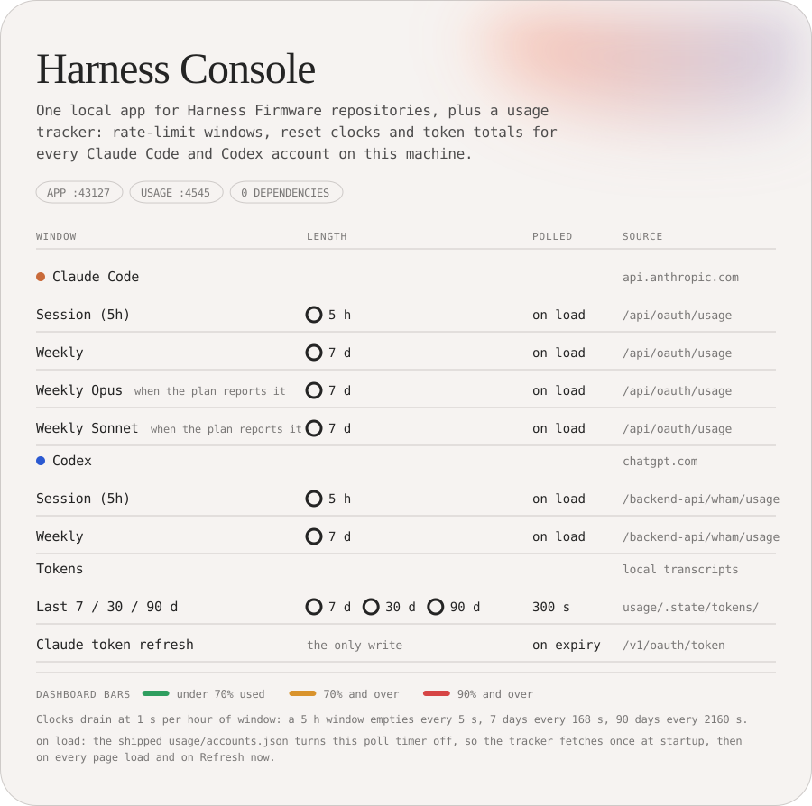

<!-- generated by scripts/readme/build.mjs. do not edit by hand. -->

<picture>
<source media="(max-width: 500px) and (prefers-color-scheme: dark)" srcset="assets/readme/masthead-narrow-dark.svg">
<source media="(max-width: 500px)" srcset="assets/readme/masthead-narrow-light.svg">
<source media="(prefers-color-scheme: dark)" srcset="assets/readme/masthead-dark.svg">

</picture>

Harness Console is one local app for working with Harness Firmware repositories on Windows, with a usage tracker built in. It clones and updates your GitHub repositories, creates new projects from the Harness-Firmware template, brings template skill changes into Harness clones you already have, installs Harness skills into DSH, and shows rate-limit and token usage for every Claude Code and Codex account on the machine. Both servers listen on 127.0.0.1 only. Node only, no dependencies.

This repository was formerly UsageTracker; the tracker now lives in `usage/`.

## Run

Node.js 24, Git and the GitHub CLI (`gh`) must be on PATH. Nothing is installed from npm.

Double-click `Launch Harness Console.vbs`, or run from a terminal:

```bash
node launcher.mjs
```

The launcher serves the app at http://127.0.0.1:43127, starts the usage tracker on port 4545 when nothing answers there, and opens the app in your browser. The `USAGE_PORT` environment variable changes the tracker port for both the launcher and `usage/server.mjs`.

Every launch starts fresh, so code edits load. A Harness Console already on port 43127 is asked to quit and is replaced, and a tracker running from this folder's `usage/server.mjs` is stopped and started again. When the running app is in the middle of an operation (clone, update, create, skill sync or DSH install), the launcher keeps it and only opens a new tab. Another service on port 43127 is left running and the launcher exits with an error; another tracker already answering on port 4545 is reused.

Select **Quit app** at the bottom of the page to stop Harness Console, and with it the tracker if this launch started it. Closing the browser tab leaves both running. In a terminal, Ctrl+C stops the launcher.

If the app asks you to sign in, **Sign in** runs `gh auth login --web` and shows the one-time code in the activity log. Credentials stay with the GitHub CLI, and an existing login is reused.

## App tabs

The app has five tabs (Usage, Repositories, New project, Skill sync, DSH skills) and opens on Usage. The sidebar lists every repository your GitHub account can reach, private ones included; its ↻ button reloads the list. Organization access depends on your GitHub authorization and any organization SSO requirements.

### Usage

Embeds the [usage tracker](#usage-tracker) from port 4545. Until the tracker answers, the tab shows a waiting message.

### Repositories

Choose a repository, check its destination (`~/CoreWise/<name>`), then select **Clone main**. The app creates a normal Git working folder with `origin` and `main` tracking `origin/main`; a repository without `main` shows an error. **Open on GitHub**, next to the repository name, opens the repository's page.

When the destination already holds a clone of the same repository, the button reads **Update main**: it fetches `origin/main`, switches to `main` if another branch is checked out, and fast-forwards. It refuses, changing nothing, when tracked files have uncommitted changes, when local `main` has commits GitHub lacks, or when the folder points at a different origin. Repositories with the same name share a destination, so move an existing folder before cloning another repository with that name.

### New project

Name the repository, add an optional description, choose private or public, and open **Skills** to leave out optional Harness skills. The list is read live from the template on GitHub; `init-project` always stays. **Create repository** runs `gh repo create <name> --template ryanportfolio/Harness-Firmware --clone` inside `~/CoreWise`, strips the template-only files (bootstrap, .claude-plugin, the validate-template workflow, issue templates, CHANGELOG, CONTRIBUTING), replaces README.md with a one-line stub, removes the deselected skill folders and marks them `off` in `.claude/settings.json`, commits, and pushes. The project ends up on GitHub and cloned locally with `main` tracking `origin/main`. Creation needs a signed-in GitHub CLI.

### Skill sync

Brings template skill changes into the Harness repositories cloned in `~/CoreWise`. Opening the tab, or **Check repositories**, fetches `origin/main` for every clone and compares each skill folder with the template's main, using a template copy cached in `~/.corewise-cloner/harness-firmware.git`. A skill folder that matches some earlier template version was never edited in that repository, so it is offered as an update. Skills the template added are offered as additions, and skills it dropped as removals. Skills turned `off` in `.claude/settings.json` are not added back.

Nothing starts selected. Tick single skills, use a repository's **All updates and additions** box, or **Select all updates and additions** for every repository; **Unselect all** clears everything. Removals are ticked one by one. Skills edited in the repository are listed with the files that differ; ticking one replaces the edited copy with the template's and loses those edits. To merge edits by hand instead, use the `sync-starter` skill inside that repository.

**Push to main** asks for a second click. For each repository it then checks the choices again against a fresh fetch, builds the change in a temporary Git worktree on `origin/main`, copies the skill folders and registry entries while keeping any Codex mode the repository already chose, runs the repository's own `sync-codex-skills.mjs` and `check-skill-capabilities.mjs`, and pushes one commit straight to `main`. A repository is skipped, with nothing pushed, when either script passed before the change and fails after it, or when GitHub's main moved. An edited skill that changed again on GitHub since the check is skipped. Your local folders, branches and uncommitted work are never changed; use **Update main** on the Repositories tab to pull the result.

### DSH skills

Installs skills from the Harness-Firmware clone at `~/CoreWise/Harness-Firmware` into DSH's global skill folder, `~/.dsh/skills` (the `DSH_HOME` environment variable moves `~/.dsh`). Skills are read from that clone's `origin/main` after a fetch, so uncommitted and untracked files in the working folder never travel. Files that may hold secrets, caches and generated output are reported and skipped.

**Check DSH skills** previews every skill without changing anything, grouped as Add, Update, Changed in DSH, Current and Cannot install. Each one is checked with DSH's own skill parser, loaded from the DSH install, so start DSH once before the first check. A skill changed in DSH since Harness Console installed it, or installed there by hand, gets a **Compare** button that shows the diff and a **Back up the DSH copy** box, ticked by default. With the box ticked the old copy moves to `~/.corewise-cloner/dsh-backups`; cleared, it is replaced without a backup.

**Install in DSH** asks for a second click. Each skill is written to a staging folder beside the skill folder, checked with DSH's parser, swapped in by rename and checked again in place. Any failure puts the previous copy back, so a skill ends up either fully installed or unchanged.

## Where state lives

- `~/CoreWise/`: repository clones, including the Harness-Firmware clone the DSH tab reads.
- `~/.corewise-cloner/preferences.json`: the last selected repository. No credentials.
- `~/.corewise-cloner/harness-firmware.git`: the template cache for Skill sync.
- `~/.corewise-cloner/dsh-installs.json` and `dsh-backups/`: what the DSH tab installed, and the copies it replaced.
- `usage/.state/`: the tracker's snapshots, token cache and price table.

The `CoreWise` and `.corewise-cloner` names come from the app's earlier name and are kept so existing clones and state carry over. GitHub credentials stay with the GitHub CLI.

The app accepts requests only for its exact loopback host and browser origin, and every change needs a per-session token. Clone URLs are built from repository identities the GitHub API returned; the browser cannot supply a URL or a command. Git and `gh` run with argument arrays and no shell.

## Tests

```bash
node --test test/*.test.mjs
```

The tests use temporary local Git repositories and an injected GitHub adapter, so they do not prove live GitHub access or private repository authorization. For an isolated manual run, start the app server alone with its own folders; it does not start the tracker:

```bash
node server.mjs --port 43128 --root "C:\path\to\test-clones" --preferences "C:\path\to\test-preferences.json" --open
```

## Usage tracker

The tracker in `usage/` serves one local page for every Claude Code and Codex account on the machine: how much of each rate-limit window is used, when it resets, and the tokens each provider burned over the last 7, 30 or 90 days. It reads the credential files the CLIs write on login and the transcripts they leave on disk. The one write is the Claude token refresh. 4 source files, no dependencies.

### Run the tracker alone

The launcher starts it. To run it without the app:

```bash
node usage/server.mjs
```

Open http://127.0.0.1:4545. The page rereads the tracker's cached snapshot every 30 seconds and the reset countdowns tick every 15; "Refresh now" and every page load poll each account and rescan transcripts at once.

### Accounts

`usage/accounts.json` lists one entry per account:

```json
{ "name": "Claude 2", "kind": "claude", "dir": "~/.claude-2" }
```

- `kind: "claude"` reads `<dir>/.credentials.json`, the file Claude Code writes on login.
- `kind: "codex"` reads `<dir>/auth.json`, the file Codex writes on login.

Each account needs its own directory so its credentials survive a login elsewhere. The first account of each kind uses the default directory (`~/.claude`, `~/.codex`). Log a second account into a separate directory once:

```bash
$env:CLAUDE_CONFIG_DIR = "$HOME\.claude-2"; claude login
```

```bash
$env:CODEX_HOME = "$HOME\.codex-2"; codex login
```

The tracker never switches accounts; it only reads.

### What it shows

| Provider | Windows | Extras |
|---|---|---|
| Claude Code | Session (5h), Weekly, Weekly Opus, Weekly Sonnet (the last two when the plan reports them) | plan tier and email; extra-usage credits when enabled |
| Codex | Session and Weekly, whichever the API reports as active | plan and email; credit balance; banked rate-limit resets with their expiry dates |

Bars turn amber at 70% used and red at 90%. A card with a red border shows the last error; if an earlier fetch succeeded, the old numbers stay visible with their age.

### Token totals

Neither provider reports token counts over an API, so the tracker reads the transcripts the CLIs write on this machine: `<dir>/projects/**/*.jsonl` for Claude Code, `<dir>/sessions/**/*.jsonl` for Codex. Transcripts carry no account identifier, and logging out and back in with another email puts both accounts' sessions in the same directory, so totals are shown per provider, combined across accounts. Sessions run on other machines are not counted.

Each provider panel shows the total, split into uncached input, cache reads, cache writes and output, with the top three models and a bar per day. Under it sits an API-equivalent dollar figure, which prices the same traffic at public API rates from [LiteLLM's table](https://github.com/BerriAI/litellm/blob/main/model_prices_and_context_window.json), fetched once a day and cached in `usage/.state/pricing.json`. It is not a subscription bill. Models missing from the table show as unpriced unless `priceAliases` in `usage/accounts.json` maps them to a priced model, for example `"codex-auto-review": "gpt-5.6-sol"` for Codex's internal reviewer.

Parsing follows [T3 Code](https://github.com/pingdotgg/t3code) (MIT) and ccusage: Claude lines are deduplicated by message id and request id (one message spans several transcript lines), Codex totals sum `last_token_usage` deltas with re-emitted duplicates dropped, and the parent history copied into a forked Codex rollout is skipped.

Parsed records are cached per file in `usage/.state/tokens/`, keyed by size and mtime, so a rescan (every 300 seconds, `tokenScanSeconds` in `usage/accounts.json`) reads only files that changed, and a grown file only from where the last read stopped. Records are kept 400 days after the CLI deletes the transcript, so history outlives Claude Code's `cleanupPeriodDays` (default 30; raise it in `settings.json` so the first scan can backfill further).

### Tokens and polling

- Claude access tokens expire after a few hours. When one is expired, the tracker refreshes it with the stored refresh token (same endpoint and client id the CLI uses) and writes the new token back to that account's `.credentials.json`, atomically. This is the only write the tracker performs. If the refresh token itself is rejected, the card says to run `claude` in that directory.
- Codex access tokens last about ten days and the CLI refreshes them on use. The tracker never refreshes Codex tokens; it warns 24 hours before expiry.
- The shipped `usage/accounts.json` sets `claudePollSeconds` to 0, so the Claude timer is off: each Claude account is fetched once at startup, then on every page load and on "Refresh now". A nonzero value polls on a timer at that many seconds; with the key removed the server uses 180 seconds (the usage endpoint rate-limits faster polling).
- The shipped `usage/accounts.json` sets `codexPollSeconds` to 0, so the Codex timer is off: each Codex account is fetched once at startup, then on every page load and on "Refresh now". A nonzero value polls on a timer at that many seconds; with the key removed the server uses 60 seconds.
- Every refresh and page load polls upstream; set `claudeMinRefreshSeconds` or `codexMinRefreshSeconds` to skip accounts fetched more recently than that. A 429 from either usage API parks that account for five minutes. When a Claude or Codex login has lapsed, the card shows **Sign in again**, which opens a console window running the CLI login for that config dir. The last good snapshot per account is cached in `usage/.state/` so the page shows data right after a restart.

### Endpoints used

| Call | Purpose |
|---|---|
| `GET api.anthropic.com/api/oauth/usage` | Claude windows |
| `GET api.anthropic.com/api/oauth/profile` | Claude email |
| `POST platform.claude.com/v1/oauth/token` | Claude token refresh |
| `GET chatgpt.com/backend-api/wham/usage` | Codex windows, plan, credits |
| `GET chatgpt.com/backend-api/wham/rate-limit-reset-credits` | Codex banked resets |
| `GET raw.githubusercontent.com/BerriAI/litellm/main/model_prices_and_context_window.json` | model prices (LiteLLM) |

The vendor calls are not documented public APIs. They are the same calls the CLIs and [CodexBar](https://github.com/steipete/CodexBar) make; request shapes were taken from [Win-CodexBar](https://github.com/nesszer/Win-CodexBar) (MIT), and either vendor can change them without notice.

## README

`README.md` and `assets/readme/*.svg` are generated: `node scripts/readme/build.mjs` reads the numbers out of the source files and fails if any drift. Edit `scripts/readme/`, not the output. The repo's About panel (description and topics) comes from `scripts/readme/repo.json`; `node scripts/readme/meta.mjs --apply` pushes it, and after a merge CI fails when the live values or the README's remote links no longer answer.

## License

[MIT](LICENSE).
